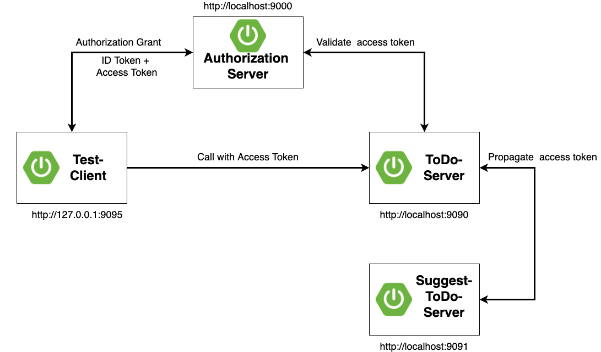
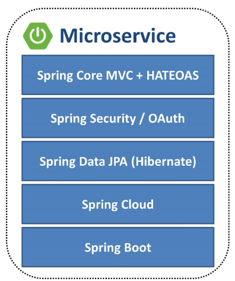

# The sample workshop application

For the hands-on workshop labs you will be provided a complete spring mvc web server application together
with a corresponding spring mvc thymeleaf web client app.    

__Table of Contents__

* [Application Component View](#application-components)
* [Technology Stack](#tech-stack)
* [Server Architecture](#server-architecture)
  * [REST Api](#rest-api)
  * [Server Layers](#server-layers)
  * [Users and Roles](#server-users-and-roles)
  * [Provided application](#provided-server-application)
* [Client Architecture](#client-architecture)
  * [Client Layers](#client-layers)
  * [Users and Roles](#client-users-and-roles)
  * [Provided application](#provided-client-application)

## Application Components

The server application provides a RESTful service for administering todo items and users.

Use cases of this application are:

* Administer todo items (List, view and create todo items)
* Administer users 

## Tech Stack

The demo client and server application both are build using the [Java](https://adoptopenjdk.net/) programming language and utilizing
the [Spring Framework](https://spring.io).

The following figure shows a typical Microservice technology stack implemented by various Spring projects.

## Server Architecture

The RESTful service for todo items and users is build using the Spring MVC annotation model and Spring HATEOAS.

The application also contains a complete documentation for the RESTful API that is automatically 
initialized when starting the provided application. You can find this after starting the server application: [REST API documentation](http://localhost:9090/swagger-ui.html).

The server application is already secured by basic authentication and also includes authorization using static roles. 

### Server Layers

The domain model of the server application is quite simple and just consists of _ToDoItem_ and _User_ models.   
The packages of the application are organized according to the different application layers:

* __api__: Contains the complete RESTful service
* __service__: The service classes (quite simple for workshop, usually these contain the business logic)
* __entity__: All domain models and repositories

In addition, there more packages with supporting functions:

* __config__: All spring configuration classes
* __security__: All security relevant classes, e.g. a _UserDetailsService_ implementation

### REST API

To call the provided REST API you can use curl, postman or httpie. 
For details on how to call the REST API please consult the [REST API documentation](http://localhost:9090/swagger-ui.html) 
which also provides the possibility to execute requests for the API endpoints.

### Server Users and roles

There are two target user roles for this application:

* USER: Standard user who can list and add todo items
* ADMIN: An administrator user who can list, add or remove users and can see all todo items of all users

__Important:__ We will use the following users in all subsequent labs from now on:

| Username | Email                    | Password | Role   |
| ---------| ------------------------ | -------- |--------|
| bwayne   | bruce.wayne@example.com  | wayne    | USER   |
| ckent    | clark.kent@example.com   | kent     | USER   |
| pparker  | peter.parker@example.com | parker   | ADMIN  |

These users are configured for basic authentication and also later for authenticating using keycloak.

### Provided Server applications

#### ToDo Server application

You can find the provided initial server application beneath the [lab 1 folder](../lab1) as 
[initial](../lab1/initial).

#### Suggest ToDo Server application

You can find the provided Suggest ToDo items server application beneath the [lab 3 folder](../lab3) as
[initial](../lab3/other).

This application is used as target server to propagate an access token to when calling from the ToDo item server application.

## Client Architecture

The client is just able to perform the login using the spring authorization server and to make a test call to get and display the list of all ToDo items for the currently authenticated user. This way you can test the correct communication between client and server without any other tool like postman.

### Client Layers

The domain model of the client application is quite simple and just consists of _ToDoItemResource_ and _User_ models.   
The packages of the application are organized according to the different application layers:

* __web__: Contains the complete spring web mvc layer with all required client side resources

In addition, there is one more package with supporting functions:

* __config__: All spring configuration classes

In _resources/templates_ you find all thymeleaf html templates.  
These templates use the bootstrap framework that resides 
in _resources/static_ folder.

### Client Users and Roles

There are two target user roles for this client-/server application:

* USER: Standard user who can list and add todo items
* ADMIN: An administrator user who can list, add or remove users and can see all todo items (of all users)

| Username | Email                    | Password | Role   |
| ---------| ------------------------ | -------- |--------|
| bwayne   | bruce.wayne@example.com  | wayne    | USER   |
| ckent    | clark.kent@example.com   | kent     | USER   |
| pparker  | peter.parker@example.com | parker   | ADMIN  |

### Provided Client application

You can find the provided initial client application beneath the [test-client folder](../test-client).

