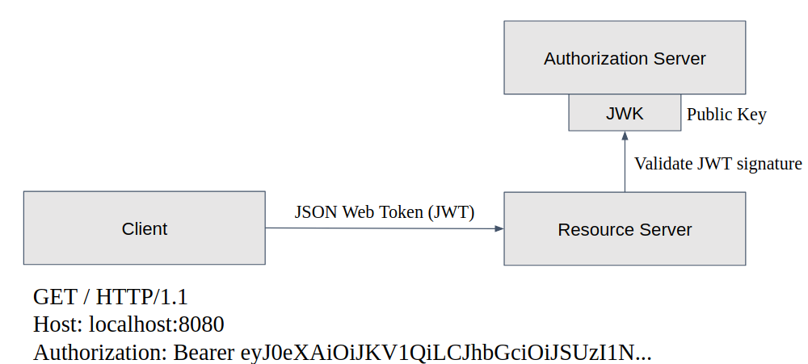
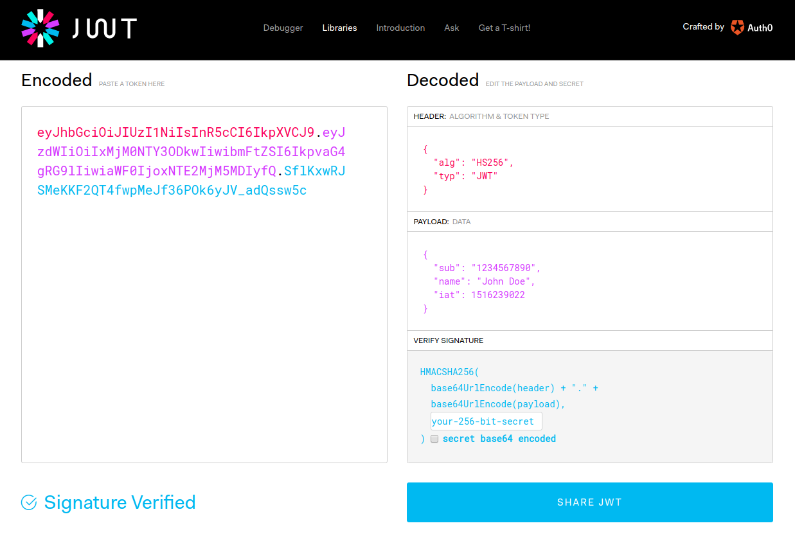
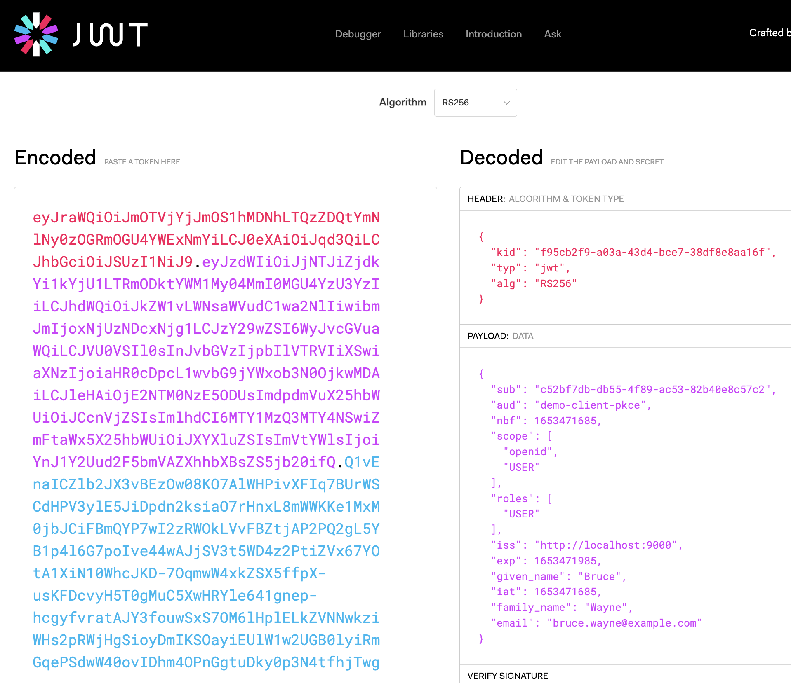

# Lab 1: Creating an OAuth 2.0/OIDC compliant Resource Server (with JWT)

In this first part we extend an existing Microservice to an OAuth 2.0 and OpenID Connect 1.0 compliant Resource Server.

See [Spring Security 5 Resource Server reference doc](https://docs.spring.io/spring-security/site/docs/current/reference/htmlsingle/#oauth2resourceserver)
for all details on how to build and configure a resource server.

__Please check out the [complete documentation](../application-architecture) for the sample application before
starting with the first hands-on lab (especially the server side parts)__.

## Lab Contents

* [Learning Targets](#learning-targets)
* [Folder Contents](#folder-contents)
* [Tutorial: Implement a resource server with custom user/authorities mapping](#start-the-lab)
    * [Explore the initial server application](#explore-the-initial-application)
    * [Step 1: Configure as resource server](#step-1-basic-configuration)
    * [Step 2: Run and test basic resource server](#step-2-run-and-test-basic-resource-server)
    * [Step 3: Implement a custom JWT converter](#step-3-custom-jwt-converter)
    * [Step 4: An additional JWT validator for 'audience' claim](#step-4-jwt-validation-for-the-audience-claim)

## Learning Targets

In this lab we will build an OAuth2/OIDC compliant resource server.



We will use Spring Authorization Server as identity provider.  
Please again make sure you have set up Spring Authorization Server as described in [setup](../setup/README.md)

In lab 1 you will learn how to:

1. Implement a basic resource server requiring bearer token authentication using JSON web tokens (JWT)
2. Customize the resource server with __user & authorities mapping__
3. Implement additional recommended validation of the _audience_ claim of the access token

## Folder Contents

In the lab 1 folder you find 2 applications:

* __initial__: This is the application we will use as starting point for this lab
* __final-automatic__:  This is the completed application for this lab using automatic standard authorization mapping of scopes to JWT principal 
* __final-jwt__: This is the completed application for this lab using custom authorization mapping with JWT principal
* __final-user__: This is the completed application for this lab using full custom user mapping with _User_ class as principal

## Start the Lab

Now, let's start with this lab.

### Explore the initial application

Please navigate your Java IDE to the __lab1/initial__ project and at first explore this project a bit.  
Then start the application by running the class _com.example.todo.ToDoApplicationLab1Initial_ inside your IDE
or by issuing a `gradlew bootRun` command.

As already described in the [application architecture](../application-architecture) section the initial application
is secured using basic authentication.

There are two target user roles for this application:

* USER: Standard user who can list and add todo items
* ADMIN: An administrator user who can list, add or remove users and can see all todo items (of all users)

| Username | Email                    | Password | Role   |
| ---------| ------------------------ | -------- |--------|
| bwayne   | bruce.wayne@example.com  | wayne    | USER   |
| ckent    | clark.kent@example.com   | kent     | USER   |
| pparker  | peter.parker@example.com | parker   | ADMIN  |

To test if the application works as expected, either

* open a web browser and navigate to [localhost:9090/api/todos](http://localhost:9090/api/todos)
  and use _bwayne_ and _wayne_ as login credentials
* or use a command line like curl or httpie or postman (if you like a UI)

Httpie:
```shell
http localhost:9090/api/todos user==c52bf7db-db55-4f89-ac53-82b40e8c57c2 --auth 'bwayne:wayne'
``` 

Curl:
```shell
curl "http://localhost:9090/api/todos?user=c52bf7db-db55-4f89-ac53-82b40e8c57c2" -u bwayne:wayne
```

If this succeeds you should see a list of ToDo items in JSON format.

Try the same request without specifying any user:

```shell
http localhost:9090/api/todos
``` 

Then you should see the following response:

```http
HTTP/1.1 401 
Cache-Control: no-cache, no-store, max-age=0, must-revalidate
Connection: keep-alive
...
WWW-Authenticate: Basic realm="Realm"
``` 

Also, try to request the list of users with same user credentials of 'bruce.wayne@example.com / wayne'.

Httpie:

```shell
http localhost:9090/api/users --auth 'bwayne:wayne'
``` 

Curl:

```shell
curl -i http://localhost:9090/api/users -u bwayne:wayne
```

__Question:__ What response would you expect here?

To answer this question have a look again at the user roles and what are the permissions associated with these roles.
You might try again to get the list of users this way (with Peter Parker):

Httpie:

```shell
http localhost:9090/api/users --auth 'pparker:parker'
``` 

Curl:

```shell
curl http://localhost:9090/api/users -u pparker:parker
``` 

This time it should work, and you should see the list of users.

<hr>

### Step 1: Basic Configuration

In the first step we will perform tha basic steps to transform the server application into
a basic OAuth2 & OIDC compliant resource server.

#### Add Gradle Dependencies

To change this application into a resource server you have to make changes in the dependencies
of the gradle build file _build.gradle_:

Remove this dependency:
```groovy
implementation('org.springframework.boot:spring-boot-starter-security')
```
and add this dependency instead:
```groovy
implementation('org.springframework.boot:spring-boot-starter-oauth2-resource-server')
```

__Note__: If you still get compilation errors after replacing dependencies please trigger a gradle update
(check how this is done in your IDE, e.g. in Eclipse there is an option in project context menu, in IntelliJ
click the refresh toolbar button in the gradle tool window).

#### Configure The Resource Server

Spring security 5 uses the
[OpenID Connect Discovery](https://openid.net/specs/openid-connect-discovery-1_0.html#ProviderConfig) specification
to completely configure the resource server to use our Spring Authorization Server instance.

__Make sure Spring Authorization Server has been started as described in the [setup](../setup/README.md) section.__

Navigate your web browser to the url [localhost:9000/.well-known/openid-configuration](http://localhost:9000/.well-known/openid-configuration).  
Then you should see the public discovery information that Spring Authorization Server provides
(like the following).

```json
{
  "authorization_endpoint": "http://localhost:9000/oauth2/authorize",
  "grant_types_supported": [
    "authorization_code",
    "client_credentials",
    "refresh_token"
  ],
  "id_token_signing_alg_values_supported": [
    "RS256"
  ],
  "issuer": "http://localhost:9000",
  "jwks_uri": "http://localhost:9000/oauth2/jwks",
  "response_types_supported": [
    "code"
  ],
  "scopes_supported": [
    "openid"
  ],
  "subject_types_supported": [
    "public"
  ],
  "token_endpoint": "http://localhost:9000/oauth2/token",
  "token_endpoint_auth_methods_supported": [
    "client_secret_basic",
    "client_secret_post",
    "client_secret_jwt",
    "private_key_jwt"
  ],
  "userinfo_endpoint": "http://localhost:9000/userinfo"
} 
```

For configuring a resource server the important entries are _issuer-uri_ and _jwk-set-uri_.
For a resource server only the correct validation of a JWT token is significant, so it only needs to know where to load
the public key from to validate the token signature.

If you specify the _spring.security.oauth2.resourceserver.jwt.issuer-uri_ instead then when starting the server application 
it reads the _jwk-set-uri_ from the provided openid configuration. If you do not want to check this on application start just use the _jwk-set-uri_ property.

Spring Security 5 automatically configures a resource server by specifying the _jwk-set_ uri value
as part of the predefined spring property _spring.security.oauth2.resourceserver.jwt.set-uri_

To perform this step, open _application.yml__ and add the jwk set uri property to the end of the _spring_ entry.
After adding this it should look like this:

```yaml
spring:
  application:
    name: ToDoApp
  datasource:
    embedded-database-connection: h2
    hikari:
      jdbc-url: jdbc:h2:mem:todo
  jpa:
    open-in-view: false
    generate-ddl: on
    hibernate:
      ddl-auto: create-drop
  jackson:
    default-property-inclusion: non_null
  security:
    oauth2:
      resourceserver:
        jwt:
          jwk-set-uri: http://localhost:9000/oauth2/jwks
```

**Hint: An error you get very often with files in yaml format is that the indents are not correct.
This can lead to unexpected errors later when you try to run all this stuff.**

With this configuration in place we have already a working resource server
that can handle JWT access tokens transmitted via http bearer token header.
Spring Security then validates by default:

* the JWT signature against the queried public key(s) from specified _jwks_url_
* the _issuer_ claim of the JWT
* that the JWT is not expired

Usually this configuration would be sufficient to configure a resource server (by autoconfiguring all settings using spring boot).
As there is already a security configuration for basic authentication in place (_com.example.library.server.config.WebSecurityConfiguration_),
this disables the spring boot autoconfiguration. Starting with Spring Boot 2 you always have to configure Spring Security
yourself as soon as you introduce a class which extends _WebSecurityConfigurerAdapter_.

So we have to change the existing security configuration to enable token based authentication instead of basic authentication.
We also want to make sure, our resource server is working with stateless token authentication, so we have to configure stateless
sessions (i.e. prevent _JSESSION_ cookies).

Open the class _com.example.todo.config.ToDoWebSecurityConfiguration_ and change the
existing configuration like this (only the security configuration block for the API):

```java
package com.example.todo.config;

import org.springframework.boot.actuate.autoconfigure.security.servlet.EndpointRequest;
import org.springframework.boot.actuate.health.HealthEndpoint;
import org.springframework.boot.actuate.info.InfoEndpoint;
import org.springframework.boot.actuate.metrics.export.prometheus.PrometheusScrapeEndpoint;
import org.springframework.boot.autoconfigure.security.servlet.PathRequest;
import org.springframework.context.annotation.Bean;
import org.springframework.core.annotation.Order;
import org.springframework.security.config.annotation.web.builders.HttpSecurity;
import org.springframework.security.config.annotation.web.configuration.EnableWebSecurity;
import org.springframework.security.config.annotation.web.configuration.WebSecurityCustomizer;
import org.springframework.security.config.http.SessionCreationPolicy;
import org.springframework.security.web.SecurityFilterChain;

import static org.springframework.security.config.Customizer.withDefaults;

@EnableWebSecurity
public class ToDoWebSecurityConfiguration {

  // ...  

  /*
   * Security configuration for user and todos Rest API.
   */
  @Bean
  @Order(4)
  public SecurityFilterChain api(HttpSecurity http) throws Exception {
    http.mvcMatcher("/api/**")
            .authorizeRequests()
            .mvcMatchers("/api/users/me").hasAnyAuthority("SCOPE_USER", "SCOPE_ADMIN")
            .mvcMatchers("/api/users/**").hasAuthority("SCOPE_ADMIN")
            .anyRequest().hasAnyAuthority("SCOPE_USER", "SCOPE_ADMIN")
            .and()
            // only disable CSRF for demo purposes or when NOT using session cookies for auth
            .csrf().disable() // (2)
            .sessionManagement().sessionCreationPolicy(SessionCreationPolicy.STATELESS) // 1
            .and()
            .oauth2ResourceServer().jwt(withDefaults()); // (3)
    return http.build();
  }

  // ...
}
```

This configuration above:
* configures stateless sessions (i.e. no _JSESSION_ cookies anymore) (1)
* disables CSRF protection (with stateless sessions, i.e. without session cookies this kind of attack does not work anymore, 
so we do not need this anymore). As a benefit this also enables us to even make post requests on the command line. (2)
* protects any request (i.e. requires authentication for any endpoint)
* enables this application to switch authentication to OAuth2/OIDC resource server with expecting access tokens in JWT format 
(as of spring security 5.2 you may also configure this to use opaque - aka reference - tokens instead) (3)

Also, the _PasswordEncoder_ bean defined in this configuration is not required anymore as we now stopped storing passwords
in our resource server, so you can also delete that bean definition. Please make sure that you also remove the _PasswordEncoder_ 
from the _com.example.todo.DataInitializer_ class, just replace the encoder calls here with the default string _"n/a"_ as the password 
is not relevant anymore.

<hr>

### Step 2: Run and test basic resource server

Now it should be possible to re-start the reconfigured application _com.example.todo.ToDoApplicationLab1Initial_.
Or just use the `gradlew bootRun` command.

Now, the requests you have tried when starting this lab using basic authentication won't work anymore
as we now require bearer tokens in JWT format to authenticate at our resource server.

Just to memorize: With basic authentication when omitting the credentials you got this response:

```http
HTTP/1.1 401 
WWW-Authenticate: Basic realm="Realm"
```

Now try again with this request:

httpie:

```shell
http localhost:9090/api/users
``` 

curl:

```shell
curl -i http://localhost:9090/api/users
```

You now will get this answer:

```http
HTTP/1.1 401 
WWW-Authenticate: Bearer
```

So what is needed here is a bearer token, in our case in fact a JSON Web Token (JWT).
First we need to get such token, and then we can try to call this API again.

For convenience, in the past we could use the _resource owner password grant_ to directly obtain an access token
from Spring Authorization Server via the command line by specifying our credentials as part of the request.

__You may argue now: "This is just like doing basic authentication??"__

Yes, you're right. This grant flow completely bypasses the base concepts of OAuth 2. This is why in OAuth 2.1 this grant flow 
is deprecated and will be removed from the standard.
And because of this, the Spring Authorization Server does not support that grant flow.

So, how to get a token now?
You basically have two options as part of this workshop:

1. If you have Postman installed (or just install it now from [https://www.postman.com/downloads](https://www.postman.com/downloads/)) you
can use the authorization code flow (+ PKCE) as built in functionality (even in the free edition)
2. You can use the provided test client (see [lab3](../lab3)) to get a token. Just follow instruction in the [readme](../lab3/README.md)

For both options please login as _bwayne/wayne_ to get a token authorized to perform the request following jsut now..

After you have received a token by either way above you can make the same request for a list of todos (like in the beginning of this lab) we have to
specify the access token as part of a _Authorization_ header of type _Bearer_ like this:

httpie:

```shell
http localhost:9090/api/todos user==c52bf7db-db55-4f89-ac53-82b40e8c57c2 --auth-type=bearer --auth=[access_token]
```

curl:

```shell
curl -H 'Authorization: Bearer [access_token]' \
-v "localhost:9090/api/todos user==c52bf7db-db55-4f89-ac53-82b40e8c57c2"
```

You have to replace _[access_token]_ with the one you have obtained in previous request.  
Now the user authenticates by the given token, but even with using the correct user Bruce Wayne you get a _"403"_ response (_Forbidden_).

This is due to the fact that Spring Security 5 automatically maps all scopes that are part of the
JWT token to the corresponding authorities.
For example the scopes _"openid profile"_ will be mapped automatically to the authorities _SCOPE_openid_ and _SCOPE_profile_. And for sure
that does not map to our requirement to have _ROLE_USER_ and/or _ROLE_ADMIN_ as authorities. 

Navigate your web browser to [jwt.io](https://jwt.io) and paste your access token into the
_Encoded_ text field.



If you scroll down a bit on the right hand side then you will see the following block:

```json
{
  "sub": "c52bf7db-db55-4f89-ac53-82b40e8c57c2",
  "aud": "demo-client-pkce",
  "nbf": 1653471685,
  "scope": [
    "openid",
    "USER"
  ],
  "roles": [
    "USER"
  ],
  "iss": "http://localhost:9000",
  "exp": 1653471985,
  "given_name": "Bruce",
  "iat": 1653471685,
  "family_name": "Wayne",
  "email": "bruce.wayne@example.com"
}
```

As you can see our user has the scopes _openid_, and _USER_.
Spring Security maps these scopes to the Spring Security authorities _SCOPE_openid_ and _SCOPE_USER_ by default.



If you have a look inside the _com.example.todo.service.ToDoService_ class
you will notice that this has the following authorization checks on method security layer:

```java
package com.example.todo.service;

import com.example.todo.entity.ToDoItemEntityRepository;
import org.springframework.security.access.AccessDeniedException;
import org.springframework.security.access.prepost.PreAuthorize;
import org.springframework.stereotype.Service;
import org.springframework.transaction.annotation.Transactional;

import java.util.List;
import java.util.Optional;
import java.util.UUID;
import java.util.stream.Collectors;

@Service
@PreAuthorize("hasAnyRole('USER', 'ADMIN')")
@Transactional(readOnly = true)
public class ToDoService {

    //...

    @PreAuthorize("hasRole('ADMIN')")
    public List<ToDoItem> findAll() {
        return toDoItemEntityRepository.findAll()
                .stream().map(ToDoItem::new).collect(Collectors.toList());
    }

    // ...
}
``` 

The required authorities _ROLE_ADMIN_ and _ROLE_USER_ do not match the automatically mapped authorities of _SCOPE_xxx_.
The same problem applies to our web security configuration on the web layer:

```java
package com.example.todo.config;

import org.springframework.boot.actuate.autoconfigure.security.servlet.EndpointRequest;
import org.springframework.boot.actuate.health.HealthEndpoint;
import org.springframework.boot.actuate.info.InfoEndpoint;
import org.springframework.boot.actuate.metrics.export.prometheus.PrometheusScrapeEndpoint;
import org.springframework.boot.autoconfigure.security.servlet.PathRequest;
import org.springframework.context.annotation.Bean;
import org.springframework.core.annotation.Order;
import org.springframework.security.config.annotation.web.builders.HttpSecurity;
import org.springframework.security.config.annotation.web.configuration.EnableWebSecurity;
import org.springframework.security.config.annotation.web.configuration.WebSecurityCustomizer;
import org.springframework.security.config.http.SessionCreationPolicy;
import org.springframework.security.oauth2.server.resource.authentication.JwtAuthenticationConverter;
import org.springframework.security.oauth2.server.resource.authentication.JwtGrantedAuthoritiesConverter;
import org.springframework.security.web.SecurityFilterChain;

import static org.springframework.security.config.Customizer.withDefaults;

@EnableWebSecurity
public class ToDoWebSecurityConfiguration {

  // ...
  
  /*
   * Configure actuator endpoint security.
   * Allow access for everyone to health, info and prometheus.
   * All other actuator endpoints require ADMIn role.
   */
  @Bean
  @Order(3)
  public SecurityFilterChain actuator(HttpSecurity http) throws Exception {
    http.requestMatcher(EndpointRequest.toAnyEndpoint())
            .authorizeRequests(
                    authorizeRequests ->
                            authorizeRequests
                                    .requestMatchers(EndpointRequest.to(
                                            HealthEndpoint.class,
                                            InfoEndpoint.class,
                                            PrometheusScrapeEndpoint.class))
                                    .permitAll()
                                    .requestMatchers(EndpointRequest.toAnyEndpoint()).hasRole("ADMIN")
            )
            .httpBasic(withDefaults()).formLogin(withDefaults());
    return http.build();
  }

  /*
   * Security configuration for user and todos Rest API.
   */
  @Bean
  @Order(4)
  public SecurityFilterChain api(HttpSecurity http) throws Exception {
    http.mvcMatcher("/api/**")
            .authorizeRequests()
            .mvcMatchers("/api/users/me").hasAnyRole("USER", "ADMIN")
            .mvcMatchers("/api/users/**").hasRole("ADMIN")
            .anyRequest().hasAnyRole("USER", "ADMIN")
            .and()
            // only disable CSRF for demo purposes or when NOT using session cookies for auth
            .csrf().disable()
            .sessionManagement().sessionCreationPolicy(SessionCreationPolicy.STATELESS)
            .and()
            .oauth2ResourceServer().jwt(withDefaults());
    return http.build();
  }

  // ...
}
```

To fix this you basically have 3 options:

1. Adapt our configuration in _com.example.todo.config.ToDoWebSecurityConfiguration_ and the _@PreAuthorize_ annotations with the _SCOPE_xx_ authorities
in the service classes. You can imagine what effort this would be especially for big applications using lots of authorizations. 
So usually only makes sense for small applications with only a few authorities to be replaced.
2. Implement a simple mapping that reads the authorities from the intended _roles_ claim and not from the scopes and also uses
   the _ROLE__ prefix again instead of _SCOPE__.
3. Implement a full conversion that maps all contents (like firstname and lastname in addition to the roles and authorities) 
of the JWT to our _User_ object

Here you see the adapted security configuration for option 1:

```
package com.example.todo.config;

import org.springframework.boot.actuate.autoconfigure.security.servlet.EndpointRequest;
import org.springframework.boot.actuate.health.HealthEndpoint;
import org.springframework.boot.actuate.info.InfoEndpoint;
import org.springframework.boot.actuate.metrics.export.prometheus.PrometheusScrapeEndpoint;
import org.springframework.boot.autoconfigure.security.servlet.PathRequest;
import org.springframework.context.annotation.Bean;
import org.springframework.core.annotation.Order;
import org.springframework.security.config.annotation.web.builders.HttpSecurity;
import org.springframework.security.config.annotation.web.configuration.EnableWebSecurity;
import org.springframework.security.config.annotation.web.configuration.WebSecurityCustomizer;
import org.springframework.security.config.http.SessionCreationPolicy;
import org.springframework.security.web.SecurityFilterChain;

import static org.springframework.security.config.Customizer.withDefaults;

@EnableWebSecurity
public class ToDoWebSecurityConfiguration {

    // ...

    /*
     * Configure actuator endpoint security.
     * Allow access for everyone to health, info and prometheus.
     * All other actuator endpoints require ADMIn role.
     */
    @Bean
    @Order(3)
    public SecurityFilterChain actuator(HttpSecurity http) throws Exception {
        http.requestMatcher(EndpointRequest.toAnyEndpoint())
                .authorizeRequests(
                        authorizeRequests ->
                                authorizeRequests
                                        .requestMatchers(EndpointRequest.to(
                                                HealthEndpoint.class,
                                                InfoEndpoint.class,
                                                PrometheusScrapeEndpoint.class))
                                        .permitAll()
                                        .requestMatchers(EndpointRequest.toAnyEndpoint()).hasAuthority("SCOPE_ADMIN")
                )
                .httpBasic(withDefaults()).formLogin(withDefaults());
        return http.build();
    }

    /*
     * Security configuration for user and todos Rest API.
     */
    @Bean
    @Order(4)
    public SecurityFilterChain api(HttpSecurity http) throws Exception {
        http.mvcMatcher("/api/**")
                .authorizeRequests()
                .mvcMatchers("/api/users/me").hasAnyAuthority("SCOPE_USER", "SCOPE_ADMIN")
                .mvcMatchers("/api/users/**").hasAuthority("SCOPE_ADMIN")
                .anyRequest().hasAnyAuthority("SCOPE_USER", "SCOPE_ADMIN")
                .and()
                // only disable CSRF for demo purposes or when NOT using session cookies for auth
                .csrf().disable()
                .sessionManagement().sessionCreationPolicy(SessionCreationPolicy.STATELESS)
                .and()
                .oauth2ResourceServer().jwt(withDefaults());
        return http.build();
    }

    /...
}
```

You can find this kind of solution in the corresponding final reference solution located in the [lab1/final-automatic](final-automatic) folder.
In the following sections we will look into the other two mapping options.
Let's start with option 2.

<hr>

### Step 3: Custom JWT authorities mapper

To achieve this simply add the following new bean to our web security configuration class:

```
package com.example.todo.config;

import org.springframework.boot.actuate.autoconfigure.security.servlet.EndpointRequest;
import org.springframework.boot.actuate.health.HealthEndpoint;
import org.springframework.boot.actuate.info.InfoEndpoint;
import org.springframework.boot.actuate.metrics.export.prometheus.PrometheusScrapeEndpoint;
import org.springframework.boot.autoconfigure.security.servlet.PathRequest;
import org.springframework.context.annotation.Bean;
import org.springframework.core.annotation.Order;
import org.springframework.security.config.annotation.web.builders.HttpSecurity;
import org.springframework.security.config.annotation.web.configuration.EnableWebSecurity;
import org.springframework.security.config.annotation.web.configuration.WebSecurityCustomizer;
import org.springframework.security.config.http.SessionCreationPolicy;
import org.springframework.security.oauth2.server.resource.authentication.JwtAuthenticationConverter;
import org.springframework.security.oauth2.server.resource.authentication.JwtGrantedAuthoritiesConverter;
import org.springframework.security.web.SecurityFilterChain;

import static org.springframework.security.config.Customizer.withDefaults;

@EnableWebSecurity
public class ToDoWebSecurityConfiguration {

    // ...

    @Bean
    public JwtAuthenticationConverter jwtAuthenticationConverter() {
        JwtGrantedAuthoritiesConverter grantedAuthoritiesConverter = new JwtGrantedAuthoritiesConverter();
        grantedAuthoritiesConverter.setAuthoritiesClaimName("roles"); // 1
        grantedAuthoritiesConverter.setAuthorityPrefix("ROLE_"); // 2

        JwtAuthenticationConverter jwtAuthenticationConverter = new JwtAuthenticationConverter();
        jwtAuthenticationConverter.setJwtGrantedAuthoritiesConverter(grantedAuthoritiesConverter);
        return jwtAuthenticationConverter;
    }
}
```

The new bean above

* reads the spring security authorities from the _roles_ claim of the incoming JWT (1)
* maps it to spring security authorities using the _ROLE__ prefix (2)

You can find this kind of solution in the corresponding final reference solution located in the [lab1/final-jwt](final-jwt) folder.

### (Optional) Step 4: Custom JWT converter

TODO, start again here


To add our custom mapping for a JWT access token Spring Security requires us to implement
the interface _Converter<Jwt, AbstractAuthenticationToken>_.

```java
package org.springframework.core.convert.converter;

import org.springframework.lang.Nullable;

public interface Converter<S, T> {

	/**
	 * Convert the source object of type {@code S} to target type {@code T}.
	 * @param source the source object to convert, which must be an instance of {@code S} (never {@code null})
	 * @return the converted object, which must be an instance of {@code T} (potentially {@code null})
	 * @throws IllegalArgumentException if the source cannot be converted to the desired target type
	 */
	@Nullable
	T convert(S source);

}
```

In general, you have two choices here:

* Map the corresponding _LibraryUser_ to the JWT token user data and read the
  authorization data from the token and map it to Spring Security authorities
* Map the corresponding _LibraryUser_ to the JWT token user data but map locally
  stored roles of the _LibraryUser_ to Spring Security authorities.

In this workshop we will use the first approach and...

* ...read the authorization data from the _scope_ claim inside the JWT token
* ...map to our local _LibraryUser_ by reusing the _LibraryUserDetailsService_ to search
  for a user having the same email as the _email_ claim inside the JWT token

To achieve this please go ahead and create a new class _LibraryUserJwtAuthenticationConverter_
in package _com.example.library.server.security_ with the following contents:

```java
package com.example.library.server.security;

import org.springframework.core.convert.converter.Converter;
import org.springframework.security.authentication.AbstractAuthenticationToken;
import org.springframework.security.authentication.BadCredentialsException;
import org.springframework.security.authentication.UsernamePasswordAuthenticationToken;
import org.springframework.security.core.GrantedAuthority;
import org.springframework.security.core.authority.SimpleGrantedAuthority;
import org.springframework.security.oauth2.jwt.Jwt;

import java.util.Collection;
import java.util.Collections;
import java.util.Optional;
import java.util.stream.Collectors;

/** JWT converter that takes the roles from 'groups' claim of JWT token. */
@SuppressWarnings("unused")
public class LibraryUserJwtAuthenticationConverter
    implements Converter<Jwt, AbstractAuthenticationToken> {
  private static final String SCOPE_CLAIM = "scope";
  private static final String ROLE_PREFIX = "ROLE_";

  private final LibraryUserDetailsService libraryUserDetailsService;

  public LibraryUserJwtAuthenticationConverter(
      LibraryUserDetailsService libraryUserDetailsService) {
    this.libraryUserDetailsService = libraryUserDetailsService;
  }

  @Override
  public AbstractAuthenticationToken convert(Jwt jwt) {
    Collection<GrantedAuthority> authorities = extractAuthorities(jwt);
    return Optional.ofNullable(
            libraryUserDetailsService.loadUserByUsername(jwt.getClaimAsString("email")))
        .map(u -> new UsernamePasswordAuthenticationToken(u, "n/a", authorities))
        .orElseThrow(() -> new BadCredentialsException("No user found"));
  }

  private Collection<GrantedAuthority> extractAuthorities(Jwt jwt) {
    return this.getScopes(jwt).stream()
        .map(authority -> ROLE_PREFIX + authority.toUpperCase())
        .map(SimpleGrantedAuthority::new)
        .collect(Collectors.toList());
  }

  @SuppressWarnings("unchecked")
  private Collection<String> getScopes(Jwt jwt) {
    Object scopes = jwt.getClaims().get(SCOPE_CLAIM);
    if (scopes instanceof String) {
      if (StringUtils.hasText((String) scopes)) {
        return Arrays.asList(((String) scopes).split(" "));
      }
      return Collections.emptyList();
    }
    if (scopes instanceof Collection) {
      return (Collection<String>) scopes;
    }
    return Collections.emptyList();
  }
}
```

This converter maps the JWT token information to a _LibraryUser_ by associating
these via the _email_ claim. It reads the authorities from _groups_ claim in the JWT token and maps these
to the corresponding authorities.  
This way we can map these groups again to our original authorities, e.g. _ROLE_LIBRARY_ADMIN_.

No open again the class _com.example.library.server.config.WebSecurityConfiguration_ and add this new JWT
converter to the JWT configuration:

```java
package com.example.library.server.config;

import com.example.library.server.security.LibraryUserDetailsService;
import com.example.library.server.security.LibraryUserJwtAuthenticationConverter;
import org.springframework.context.annotation.Bean;
import org.springframework.context.annotation.Configuration;
import org.springframework.security.config.annotation.method.configuration.EnableGlobalMethodSecurity;
import org.springframework.security.config.annotation.web.builders.HttpSecurity;
import org.springframework.security.config.annotation.web.configuration.EnableWebSecurity;
import org.springframework.security.config.annotation.web.configuration.WebSecurityConfigurerAdapter;
import org.springframework.security.config.http.SessionCreationPolicy;
import org.springframework.security.crypto.factory.PasswordEncoderFactories;
import org.springframework.security.crypto.password.PasswordEncoder;
import org.springframework.web.cors.CorsConfiguration;
import org.springframework.web.cors.CorsConfigurationSource;
import org.springframework.web.cors.UrlBasedCorsConfigurationSource;

import java.util.Arrays;
import java.util.Collections;

import static org.springframework.security.config.Customizer.withDefaults;

@Configuration
@EnableWebSecurity
@EnableGlobalMethodSecurity(prePostEnabled = true)
public class WebSecurityConfiguration extends WebSecurityConfigurerAdapter {

  private final LibraryUserDetailsService libraryUserDetailsService;

  public WebSecurityConfiguration(LibraryUserDetailsService libraryUserDetailsService) {
    this.libraryUserDetailsService = libraryUserDetailsService;
  }

  @Override
  protected void configure(HttpSecurity http) throws Exception {
    http.sessionManagement()
        .sessionCreationPolicy(SessionCreationPolicy.STATELESS)
        .and()
        .cors(withDefaults())
        .csrf()
        .disable()
        .authorizeRequests()
        .anyRequest()
        .fullyAuthenticated()
        .and()
        .oauth2ResourceServer()
        .jwt()
        .jwtAuthenticationConverter(libraryUserJwtAuthenticationConverter());
  }
  
  @Bean
  LibraryUserJwtAuthenticationConverter libraryUserJwtAuthenticationConverter() {
    return new LibraryUserJwtAuthenticationConverter(libraryUserDetailsService);
  }
  
  @Bean
  PasswordEncoder passwordEncoder() {
    return PasswordEncoderFactories.createDelegatingPasswordEncoder();
  }
  
  @Bean
  CorsConfigurationSource corsConfigurationSource() {
    CorsConfiguration configuration = new CorsConfiguration();
    configuration.setAllowedOrigins(Arrays.asList("https://localhost:4200", "http://localhost:4200"));
    configuration.setAllowedMethods(Arrays.asList("GET", "POST", "PUT", "DELETE"));
    configuration.setAllowedHeaders(Collections.singletonList(CorsConfiguration.ALL));
    configuration.setAllowCredentials(true);
    UrlBasedCorsConfigurationSource source = new UrlBasedCorsConfigurationSource();
    source.registerCorsConfiguration("/**", configuration);
    return source;
  }
}
```

_<u>Note:</u>_: The other approach can be seen in class _LibraryUserRolesJwtAuthenticationConverter_ in completed
application in project _library-server-complete-custom_.

<hr>

### Step 4: JWT validation for the 'audience' claim

Implementing an additional token validator is quite easy, you just have to implement the
provided interface _OAuth2TokenValidator_.

According to [OpenID Connect 1.0 specification](https://openid.net/specs/openid-connect-core-1_0.html#IDToken) the _audience_ claim
is mandatory for ID tokens:

<blockquote cite=https://openid.net/specs/openid-connect-core-1_0.html#IDToken">
Audience(s) that this ID Token is intended for. It MUST contain the OAuth 2.0 client_id of the Relying Party as an audience value. It MAY also contain identifiers for other audiences.
</blockquote>

Despite the fact that the _audience_ claim is not specified or mandatory for access tokens
specifying and validating the _audience_ claim of access tokens is strongly recommended avoiding misusing access tokens for other resource servers.   
There is also a new [draft specification](https://tools.ietf.org/html/draft-ietf-oauth-access-token-jwt)
on the way to provide a standardized and interoperable profile as an alternative to the proprietary JWT access token layouts.

So we should also validate that our resource server only successfully authenticates those requests bearing access tokens
containing the expected value of "library-service" in the _audience_ claim.

So let's create a new class _AudienceValidator_ in package _com.example.library.server.security_
with the following contents:

```java
package com.example.library.server.security;

import org.springframework.security.oauth2.core.OAuth2Error;
import org.springframework.security.oauth2.core.OAuth2TokenValidator;
import org.springframework.security.oauth2.core.OAuth2TokenValidatorResult;
import org.springframework.security.oauth2.jwt.Jwt;

/** Validator for expected audience in access tokens. */
public class AudienceValidator implements OAuth2TokenValidator<Jwt> {

  private OAuth2Error error =
      new OAuth2Error("invalid_token", "The required audience 'library-service' is missing", null);

  public OAuth2TokenValidatorResult validate(Jwt jwt) {
    if (jwt.getAudience().contains("library-service")) {
      return OAuth2TokenValidatorResult.success();
    } else {
      return OAuth2TokenValidatorResult.failure(error);
    }
  }
}
```

Adding such validator is a bit more effort as we have to replace the auto-configured JwtDecoder
with our own bean definition. An additional validator can only be added this way.

To achieve this open again the class _com.example.library.server.config.WebSecurityConfiguration_
one more time and add our customized JwtDecoder.

```java
package com.example.library.server.config;

import com.example.library.server.security.AudienceValidator;
import com.example.library.server.security.LibraryUserDetailsService;
import com.example.library.server.security.LibraryUserJwtAuthenticationConverter;
import org.springframework.beans.factory.annotation.Autowired;
import org.springframework.boot.autoconfigure.security.oauth2.resource.OAuth2ResourceServerProperties;
import org.springframework.context.annotation.Bean;
import org.springframework.context.annotation.Configuration;
import org.springframework.security.config.annotation.method.configuration.EnableGlobalMethodSecurity;
import org.springframework.security.config.annotation.web.builders.HttpSecurity;
import org.springframework.security.config.annotation.web.configuration.EnableWebSecurity;
import org.springframework.security.config.annotation.web.configuration.WebSecurityConfigurerAdapter;
import org.springframework.security.config.http.SessionCreationPolicy;
import org.springframework.security.oauth2.core.DelegatingOAuth2TokenValidator;
import org.springframework.security.oauth2.core.OAuth2TokenValidator;
import org.springframework.security.oauth2.jwt.Jwt;
import org.springframework.security.oauth2.jwt.JwtDecoder;
import org.springframework.security.oauth2.jwt.JwtValidators;
import org.springframework.security.oauth2.jwt.NimbusJwtDecoder;
import org.springframework.web.cors.CorsConfiguration;
import org.springframework.web.cors.CorsConfigurationSource;
import org.springframework.web.cors.UrlBasedCorsConfigurationSource;

import java.util.Arrays;
import java.util.Collections;

import static org.springframework.security.config.Customizer.withDefaults;

@Configuration
@EnableWebSecurity
@EnableGlobalMethodSecurity(prePostEnabled = true)
public class WebSecurityConfiguration extends WebSecurityConfigurerAdapter {

    private final OAuth2ResourceServerProperties oAuth2ResourceServerProperties;

    private final LibraryUserDetailsService libraryUserDetailsService;

    @Autowired
    public WebSecurityConfiguration(
            OAuth2ResourceServerProperties oAuth2ResourceServerProperties,
            LibraryUserDetailsService libraryUserDetailsService) {
        this.oAuth2ResourceServerProperties = oAuth2ResourceServerProperties;
        this.libraryUserDetailsService = libraryUserDetailsService;
    }

    @Override
    protected void configure(HttpSecurity http) throws Exception {
        http.sessionManagement()
                .sessionCreationPolicy(SessionCreationPolicy.STATELESS)
                .and()
                .cors(withDefaults())
                .csrf()
                .disable()
                .authorizeRequests()
                .anyRequest()
                .fullyAuthenticated()
                .and()
                .oauth2ResourceServer()
                .jwt()
                .jwtAuthenticationConverter(libraryUserJwtAuthenticationConverter());
    }

    @Bean
    JwtDecoder jwtDecoder() {
        NimbusJwtDecoder jwtDecoder =
                NimbusJwtDecoder.withJwkSetUri(oAuth2ResourceServerProperties.getJwt().getJwkSetUri())
                        .build();

        OAuth2TokenValidator<Jwt> audienceValidator = new AudienceValidator();
        OAuth2TokenValidator<Jwt> withIssuer =
                JwtValidators.createDefaultWithIssuer(
                        oAuth2ResourceServerProperties.getJwt().getIssuerUri());
        OAuth2TokenValidator<Jwt> withAudience =
                new DelegatingOAuth2TokenValidator<>(withIssuer, audienceValidator);

        jwtDecoder.setJwtValidator(withAudience);

        return jwtDecoder;
    }

    @Bean
    LibraryUserJwtAuthenticationConverter libraryUserJwtAuthenticationConverter() {
        return new LibraryUserJwtAuthenticationConverter(libraryUserDetailsService);
    }

    @Bean
    CorsConfigurationSource corsConfigurationSource() {
        CorsConfiguration configuration = new CorsConfiguration();
        configuration.setAllowedOrigins(Arrays.asList("https://localhost:4200", "http://localhost:4200"));
        configuration.setAllowedMethods(Arrays.asList("GET", "POST", "PUT", "DELETE"));
        configuration.setAllowedHeaders(Collections.singletonList(CorsConfiguration.ALL));
        configuration.setAllowCredentials(true);
        UrlBasedCorsConfigurationSource source = new UrlBasedCorsConfigurationSource();
        source.registerCorsConfiguration("/**", configuration);
        return source;
    }
}
```  

As the _JwtValidators_ creator depends on the full issuer URI pointing to the OpendID Connect configuration of Spring Authorization Server
we need to add the _issuer-uri_ in addition to _jwk-set-uri_ . So basically this now should look like this in the
_application.yaml_ file:

```yaml
spring:
  jpa:
    open-in-view: false
  jackson:
    date-format: com.fasterxml.jackson.databind.util.StdDateFormat
    default-property-inclusion: non_null
  security:
    oauth2:
      resourceserver:
        jwt:
          jwk-set-uri: http://localhost:8080/auth/realms/workshop/protocol/openid-connect/certs
          issuer-uri: http://localhost:8080/auth/realms/workshop
```

Now we can re-start the application and test again the same request we had retrieved an '403' error before.
For this just use the `gradlew bootRun` command.

First get another fresh access token:

httpie:

```shell
http --form http://localhost:8080/auth/realms/workshop/protocol/openid-connect/token grant_type=password \
username=ckent password=kent client_id=library-client client_secret=9584640c-3804-4dcd-997b-93593cfb9ea7
``` 

curl:

```shell
curl -X POST -d 'grant_type=password&username=ckent&password=kent&client_id=library-client&client_secret=9584640c-3804-4dcd-997b-93593cfb9ea7' \
http://localhost:8080/auth/realms/workshop/protocol/openid-connect/token
```

This should return an access token together with a refresh token:

```http
HTTP/1.1 200 OK
Content-Type: application/json

{
    "access_token": "eyJhbGciOiJSUzI1NiIsInR5cCIgO...",
    "expires_in": 300,
    "not-before-policy": 1556650611,
    "refresh_expires_in": 1800,
    "refresh_token": "eyJhbGciOiJIUzI1NiIsInR5cCIg...",
    "scope": "profile email user",
    "session_state": "c92a82d1-8e6d-44d7-a2f3-02f621066968",
    "token_type": "bearer"
}
```

To make the same request for a list of users we have to
specify the access token as part of a _Authorization_ header of type _Bearer_ like this:

httpie:

```shell
http localhost:9091/library-server/users \
'Authorization: Bearer [access_token]'
```

curl:

```shell
curl -H 'Authorization: Bearer [access_token]' \
-v http://localhost:9091/library-server/users
```

Now, with our previous changes this request should succeed with an '200' OK status and return a list of users.

<hr>

This ends lab 1. In the next [lab 2](../lab2) we will build the corresponding web client.

__<u>Important Note</u>__: If you could not finish part 1, then just use the
project __lab1/library-server-complete__ to start into the next labs.

<hr>

To continue with the OAuth2/OIDC client application please head over to [Lab 2](../lab2).


Sending JwtAuthenticationToken [Principal=org.springframework.security.oauth2.jwt.Jwt@9dd3cf4a, Credentials=[PROTECTED], Authenticated=true, Details=WebAuthenticationDetails [RemoteIpAddress=127.0.0.1, SessionId=null], Granted Authorities=[SCOPE_openid, SCOPE_profile, SCOPE_email]] to access denied handler since access is denied