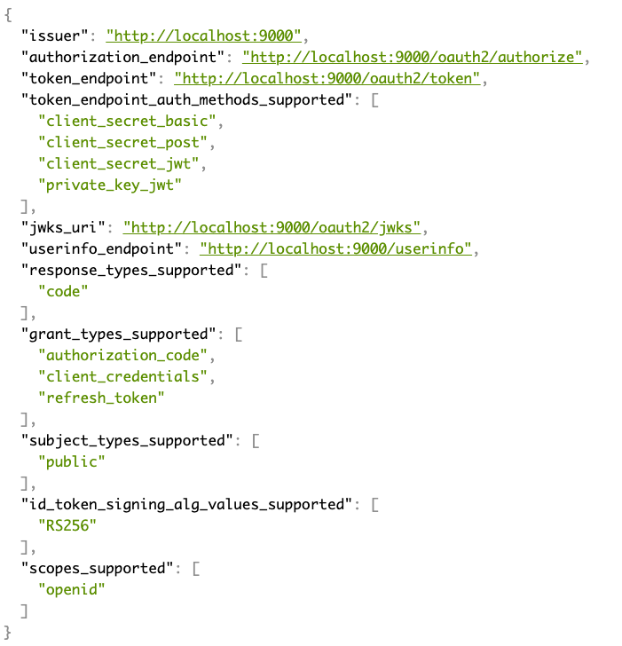

# Requirements and Setup

## Requirements

* [Java SDK](https://adoptium.net/) Version 11 or 17
* A Java IDE like
  * [Eclipse](https://www.eclipse.org/downloads)
  * [Spring Toolsuite](https://spring.io/tools)
  * [IntelliJ](https://www.jetbrains.com/idea/download)
  * [Visual Studio Code](https://code.visualstudio.com)
* [Git](https://git-scm.com)
* [Postman](https://www.getpostman.com/downloads), [Httpie](https://httpie.org/#installation), or [Curl](https://curl.haxx.se/download.html) for REST calls

In case you select [Postman](https://www.getpostman.com/downloads), then the provided [Postman Collection](../postman/todoApp.postman_collection.json) might be helpful.
Just import this [Postman Collection (Version 2.1 format)](../postman/todoApp.postman_collection.json) into Postman.

### IntelliJ

IntelliJ does not require any specific additional plugins or configuration.

### Eclipse IDE

If you are an Eclipse user, then the usage of the Eclipse-based [Spring ToolSuite](https://spring.io/tools) is strongly recommended.
This eclipse variant already has all the required gradle and spring boot support pre-installed.

In case you want to stick to your plain Eclipse installation then you have to add the following features via the
eclipse marketplace: 

* BuildShip Gradle Integration (Version 3.x). This might be already pre-installed depending 
on your eclipse variant (e.g. Eclipse JavaEE) installed.
* Spring Tools 4 for Spring Boot (Spring Tool Suite 4).

### Visual Studio Code

To be able to work properly in Visual Studio Code with this Spring Boot Java Gradle project you need at least these extensions:

* Java Extension Pack
* vscode-gradle-language
* VS Code Spring Boot Application Development Extension Pack

## Get the source code
                       
Clone this GitHub repository [https://github.com/andifalk/microservices-auth-authz-spring-security](https://github.com/andifalk/microservices-auth-authz-spring-security):

```
git clone https://github.com/andifalk/microservices-auth-authz-spring-security.git workshop
```

After that you can import the whole workshop project directory into your IDE as a __gradle project__:

* [IntelliJ](https://www.jetbrains.com/idea): Open menu item "New project from existing sources..." and then select 'Gradle' when prompted
* [Eclipse](https://www.eclipse.org/) or [Spring ToolSuite](https://spring.io/tools): Open menu item "Import/Gradle/Existing gradle project"
* [Visual Studio Code](https://code.visualstudio.com/): Just open the root directory in VS Code and wait until VS Code has configured the project

## Run the java applications

All spring boot based java projects can either be run using your Java IDE or using the command line
with changing into the corresponding project directory and issuing a `./gradlew bootRun` command.

In this workshop we will use a customized version of [Spring Authorization Server](https://github.com/spring-projects/spring-authorization-server) as local identity provider.  
[Spring Authorization Server](https://github.com/spring-projects/spring-authorization-server) implements OAuth 2.0 and OpenID Connect 1.0.

## Setup Spring Authorization Server

You need a compliant OAuth 2.0 / OpenID Connect 1.0 provider for this workshop.
Here we will use [Customized Version of Spring Authorization Server](https://github.com/andifalk/custom-spring-authorization-server).

To set up and run this project:

1. Clone or download the GitHub repository at: [https://github.com/andifalk/custom-spring-authorization-server](https://github.com/andifalk/custom-spring-authorization-server)
2. Import this project into your IDE as a gradle project
3. After the IDE has configured the project you can start the authorization server by running the main class _com.example.spring.authorizationserver.SpringAuthorizationServerApplication_

### Check Running Server

The spring authorization server does not have a UI. Instead, to prove it is running just open the web browser and navigate to http://localhost:9000/.well-known/openid-configuration.

Now, if you see the openid configuration in the browser (how nice it is shown depends on your browser addons) then spring authorization server is ready to use it for this workshop.



### Further Information

If you want to know more about setting up a spring authorization server for your own projects 
then please consult the [spring authorization server GitHub project](https://github.com/spring-projects/spring-authorization-server).
Please note that currently there is not really much documentation there, but currently the community is adding more docs.